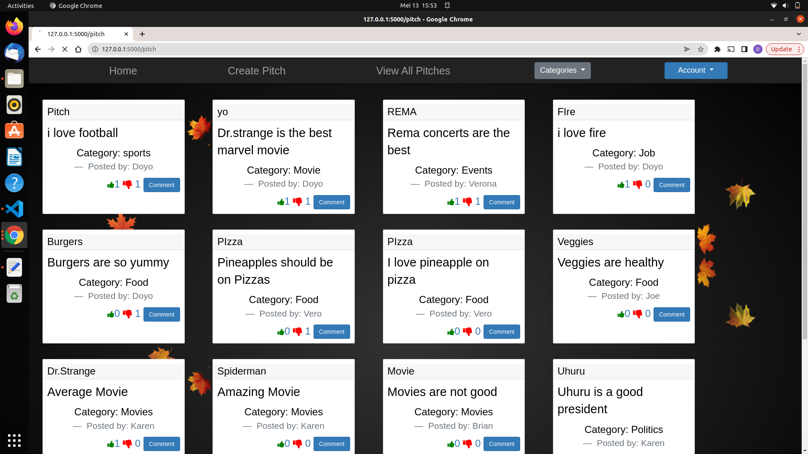
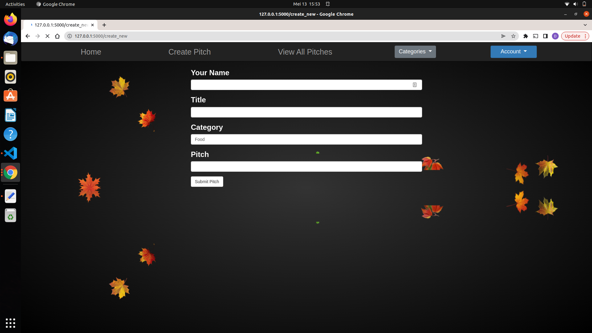
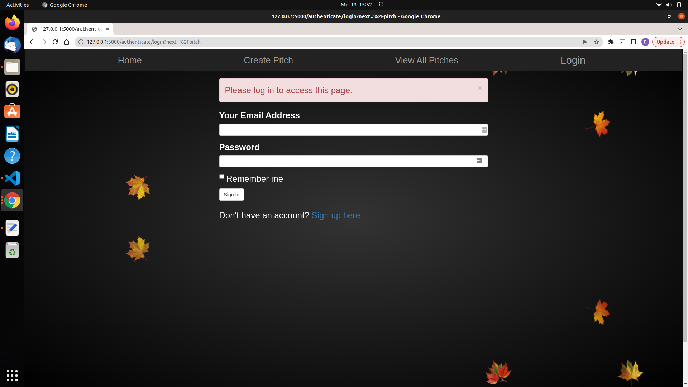

# PITCH
## BY DOYO ABDIKADIR DOYO

## Description
### In life, you only have 60 seconds to impress someone. 1 minute can make or break you. How do we make sure that you use your 1 minute to actually say something meaningful? This is an application that allows users to use that one minute wisely. You will be able to submit one minute pitches and other users will vote on them and leave comments to give their feedback on them.

## Screenshots
All Pitches

Create Pitch Page

Login Page

## Setup Instructions
### Clone or download and unzip the repository from github,https://github.com/Doyo54/Python-Flask-Week-3-IP. Then to run the application, open the cloned file in terminal and run the command:
-  python3 manage.py server

## Technologies Used
- Python3.9

## Known Bugs
No known bugs

## Deployment Problems
Deployment of app was successful but Database could not be deployed to heroku.Hence,in order to view the app properly kindly clone the repositor, install the required extensions and run the the file using the command shown above

## Copyright and license information
### The app is open source and in compliance with MIT License Copyright (c) 2022 {Doyo Abdikadir Doyo}